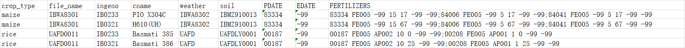

# pydssat
pydssat is a python project to run DSSAT47 model in python ,as well as creating/modification important files for DSSAT model.
__PAY ATTENTION__:This project works on ___WIN OS___ only with ___PYTHON3.6___.

## Structure
This project is consist of utils, dssat and run_model.
### utils.py
utils.py helps you to __BATCH__ create .cuX files with a specific format of input xlsx file.
It can due with different __crop type__ and different __fertilizer level__ 
_(So far I've done only this part, whoever the command statements are very similar which must be easy for you to fulfil 😀)_
### dssat.py
dssat.py contains the DSSAT class which helps to run glue and dssat model with a single .X file
### run_model.py
run_model.py makes us easier to use this project with command line.
In this file, I set some default arguments for convenient._(If needed ,please change it manually ,I am a lazy guy...😀)_

## Usage
### Input xlsx file
The only thing that we need to concern about is formatted xlsx file.

### A SIMPLE WAY:
python run_model.py -i \PATH\TO\INPUT.xlsx -e 5000
More arguments: python run_model.py --help
### SOME FLEXIBLE WAYS:
You can call the functions in this project whose keyword params are set for more flexible usage.
Keep in mind that _input.xlsx->input.json->x.files:foreach x in x,files->dssat.
